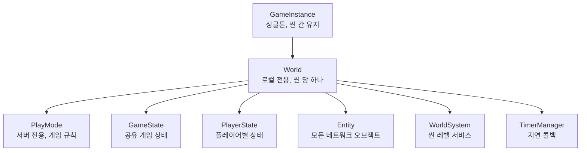
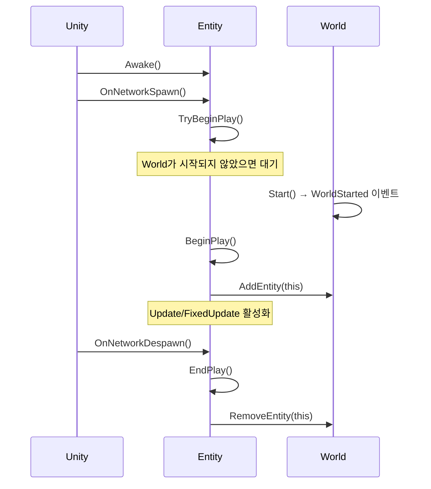
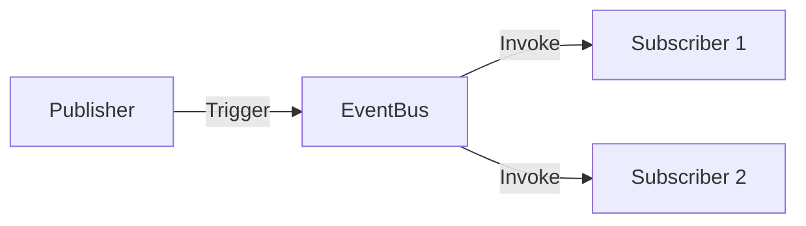

# AGENTS.md

이 파일은 Mayril 코드베이스 작업 가이드를 제공합니다.

## 프로젝트 개요

Mayril은 Unity Netcode for GameObjects 기반의 Unity 6 멀티플레이어 게임 프레임워크입니다.
네트워크 게임을 위한 핵심 추상화 기능을 제공합니다.

- **Unity 버전**: 6000.3.2f1
- **주요 패키지**: `Packages/com.nelta9x.mayril/`
- **의존성**: Unity Netcode for GameObjects 2.7.0

## 아키텍처

### 핵심 계층 구조 (Core Hierarchy)



### 엔티티 생명주기 (Entity Lifecycle)



### 주요 클래스 (Key Classes)

| Class | Role |
|-------|------|
| **GameInstance** | 앱 레벨 싱글톤, 씬 로드/언로드 처리 |
| **World** | 씬 레벨 컨테이너, 엔티티 관리, WorldSystem 자동 발견 |
| **Entity** | NetworkBehaviour 확장, `BeginPlay()`/`EndPlay()` 구현 필수 |
| **PlayMode** | 서버 전용 게임 규칙, GameState/PlayerState 스폰 |
| **Controller** | `Possess()`/`Unpossess()`로 엔티티 조종 |
| **WorldSystem** | 씬 레벨 서비스 베이스 클래스, 리플렉션으로 자동 인스턴스화 |

### 이벤트 시스템 (Event System)
- [상세 문서](Packages/com.nelta9x.mayril/Runtime/EventSystem/AGENTS.md)



- Namespace: `Mayril.EventSystem`
- `EventBus<T>.Register(handler)` / `Unregister(handler)`
- `EventBus<T>.Trigger(new Event())`
- 내장 이벤트: `WorldStarted`, `WorldDestroyed`, `EntityPlayStarted`, `EntityPlayEnded`

### 서브시스템 (Subsystems)

**AbilitySystem** - 스킬/버프 시스템 ([상세 문서](Packages/com.nelta9x.mayril/Runtime/AbilitySystem/AGENTS.md))
- `AbilitySystemComponent (ASC)`: 시스템 허브, 스탯/태그/어빌리티/이펙트 관리
- `Ability`: 액티브 스킬 로직
- `Effect`: 데이터 정의 (Spec), `EffectInstance`로 풀링되어 적용
- `EffectInstance`: 런타임 이펙트 객체, Zero Allocation (Pooling)

**TagSystem** - 계층형 태그 시스템 ([상세 문서](Packages/com.nelta9x.mayril/Runtime/TagSystem/AGENTS.md))
- `GameTag`: `int` ID 기반, `Hierarchy` 지원 (예: `Status.CC.Stun` -> `Status.CC` -> `Status`)
- `GameTagContainer`: `O(1)` 조회 성능, Expansion 전략 사용
- `GameTagManager`: 태그 등록 및 캐싱 중앙 관리

**StatSystem** - 네트워크 동기화 스탯 ([상세 문서](Packages/com.nelta9x.mayril/Runtime/StatSystem/AGENTS.md))
- `StatValue`: 기본값 + 모디파이어 → 최종값 (NetworkVariable)
- `StatModifier`: Flat, Additive, Multiplicative 타입

**InventorySystem** - 슬롯 기반 아이템 관리 ([상세 문서](Packages/com.nelta9x.mayril/Runtime/InventorySystem/AGENTS.md))
- `Inventory`: NetworkBehaviour, 슬롯 기반 저장
- `IItem`: 스태킹 지원 아이템 인터페이스

## 테스트 (Testing)

테스트 경로: `Packages/com.nelta9x.mayril/Tests/Runtime/`

**Unity Editor에서 실행 (권장):**
`Window > General > Test Runner`

**CLI로 실행 (Agent Self-Test):**
1. Unity 버전 확인: `ProjectSettings/ProjectVersion.txt`의 `m_EditorVersion`
2. 실행 명령어 (Mac 기준 예시):
```bash
# <Unity Editor Path>는 실제 Unity 설치 경로로 대체하세요.
# 예: /Applications/Unity/Hub/Editor/6000.3.2f1/Unity.app/Contents/MacOS/Unity

<Unity Editor Path> -runTests -batchmode -projectPath . -testResults TestResults.xml -testPlatform PlayMode
```

**테스트 작성 예시:**
```csharp
[TestFixture]
public class MyTests
{
    [UnitySetUp]
    public IEnumerator SetUp() { yield return null; }

    [Test]
    public void TestMethod() { }
}
```

## 코드 컨벤션 (Code Conventions)

- 문서 주석은 한국어로 작성
- 네트워크 콜백 오버라이드 시 `base.OnNetworkSpawn()` 호출 필수
- Entity 상속 시 `BeginPlay()`, `EndPlay()` 추상 메서드 구현 필수
- `Start()` 대신 `BeginPlay()` 사용 (네트워크 타이밍 보장)
- 오브젝트는 반드시 as를 이용한 캐스팅과 null 체크
- 멤버 변수와 메소드는 public, protected, private 순서로 정렬