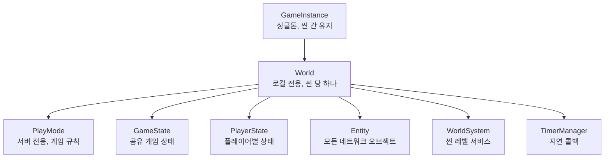
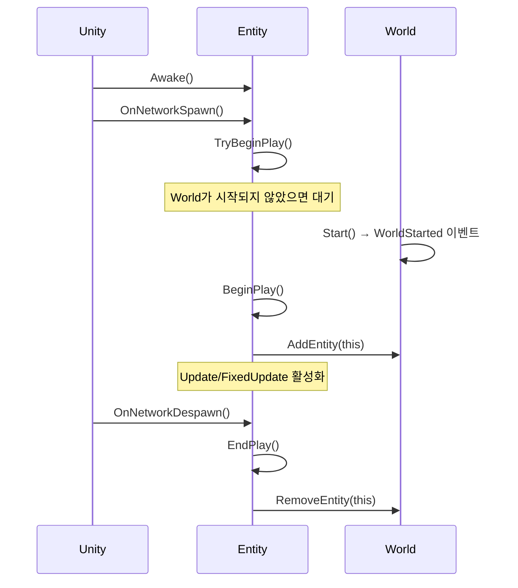
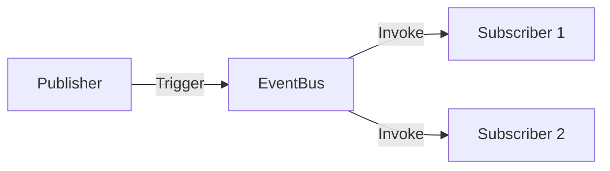

# AGENTS.md

This file provides guidance on how to work with Mayril's codebase.

## Project Overview

Mayril is a Unity 6 multiplayer game framework built on Unity Netcode for GameObjects. 
It provides core abstractions for networked games.

- **Unity Version**: 6000.3.2f1
- **Primary Package**: `Packages/com.nelta9x.mayril/`
- **Dependencies**: Unity Netcode for GameObjects 2.7.0

## Architecture

### Core Hierarchy



### Entity Lifecycle



### Key Classes

| Class | Role |
|-------|------|
| **GameInstance** | 앱 레벨 싱글톤, 씬 로드/언로드 처리 |
| **World** | 씬 레벨 컨테이너, 엔티티 관리, WorldSystem 자동 발견 |
| **Entity** | NetworkBehaviour 확장, `BeginPlay()`/`EndPlay()` 구현 필수 |
| **PlayMode** | 서버 전용 게임 규칙, GameState/PlayerState 스폰 |
| **Controller** | `Possess()`/`Unpossess()`로 엔티티 조종 |
| **WorldSystem** | 씬 레벨 서비스 베이스 클래스, 리플렉션으로 자동 인스턴스화 |

### Event System



- Namespace: `Mayril.EventSystem`
- `EventBus<T>.Register(handler)` / `Unregister(handler)`
- `EventBus<T>.Trigger(new Event())`
- 내장 이벤트: `WorldStarted`, `WorldDestroyed`, `EntityPlayStarted`, `EntityPlayEnded`

### Subsystems

**AbilitySystem** - 스킬/버프 시스템
- `IAbility`: 스킬 라이프사이클 훅 (OnSpellStart, OnDamage, OnKill 등)
- `AbilityModifier`: 지속시간, 틱 간격, 활성화 태그를 가진 버프/디버프

**StatSystem** - 네트워크 동기화 스탯
- `StatValue`: 기본값 + 모디파이어 → 최종값 (NetworkVariable)
- `StatModifier`: Flat, Additive, Multiplicative 타입

**InventorySystem** - 슬롯 기반 아이템 관리
- `Inventory`: NetworkBehaviour, 슬롯 기반 저장
- `IItem`: 스태킹 지원 아이템 인터페이스

## Testing

Tests: `Packages/com.nelta9x.mayril/Tests/Runtime/`

**Unity Editor에서 실행 (권장):**
`Window > General > Test Runner`

**CLI로 실행 (Agent Self-Test):**
1. Unity 버전 확인: `ProjectSettings/ProjectVersion.txt`의 `m_EditorVersion`
2. 실행 명령어 (Mac 기준 예시):
```bash
# <Unity Editor Path>는 실제 Unity 설치 경로로 대체하세요.
# 예: /Applications/Unity/Hub/Editor/6000.3.2f1/Unity.app/Contents/MacOS/Unity

<Unity Editor Path> -runTests -batchmode -projectPath . -testResults TestResults.xml -testPlatform PlayMode
```

**테스트 작성 예시:**
```csharp
[TestFixture]
public class MyTests
{
    [UnitySetUp]
    public IEnumerator SetUp() { yield return null; }

    [Test]
    public void TestMethod() { }
}
```

## Code Conventions

- 문서 주석은 한국어로 작성
- 네트워크 콜백 오버라이드 시 `base.OnNetworkSpawn()` 호출 필수
- Entity 상속 시 `BeginPlay()`, `EndPlay()` 추상 메서드 구현 필수
- `Start()` 대신 `BeginPlay()` 사용 (네트워크 타이밍 보장)
- 오브젝트는 반드시 as를 이용한 캐스팅과 null 체크
- 멤버 변수와 메소드는 public, protected, private 순서로 정렬