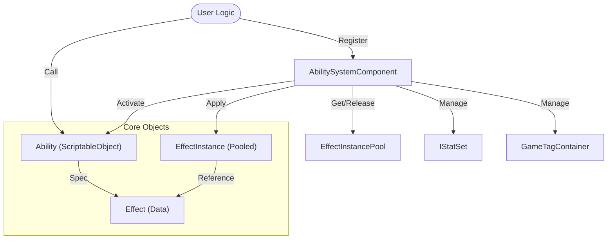

# AbilitySystem

Mayril의 AbilitySystem은 게임플레이의 동적인 상호작용(스킬, 버프, 상태이상 등)을 처리하는 핵심 프레임워크입니다.
**Minimalism(최소주의)**, **Explicitness(명시성)**, **Performance(성능)** 철학을 바탕으로 설계되었습니다.

## 아키텍처 (Architecture)



### 핵심 컴포넌트

- **`AbilitySystemComponent (ASC)`**: 시스템의 허브(Hub)입니다. 스탯, 태그, 어빌리티, 이펙트를 중앙에서 관리합니다.
- **`Ability`**: 액티브 스킬이나 행동 로직을 정의합니다. `ScriptableObject`가 아닌 순수 클래스(또는 POCO) 형태를 지향하며, 유저는 `CanActivateAbility`를 오버라이드하여 조건을 정의합니다.
- **`Effect`**: 스탯 변경이나 태그 부여 등의 데이터 정의(Spec)입니다.
- **`EffectInstance`**: 런타임에 실제로 적용된 이펙트 객체입니다. **Object Pooling**을 통해 재사용됩니다.

## 사용 가이드 (Usage Guide)

### 1. 초기화 (Explicit Registration)

ASC는 자동으로 스탯을 찾지 않습니다. (`No Magic`). 반드시 `RegisterStats`를 통해 명시적으로 등록해야 합니다.

```csharp
public class MyEntity : NetworkBehaviour
{
    private AbilitySystemComponent _asc;
    private MyStatSet _stats;

    private void Awake()
    {
        _asc = GetComponent<AbilitySystemComponent>();
        _stats = GetComponent<MyStatSet>();

        // 명시적 등록
        _asc.RegisterStats(_stats);
    }
}
```

### 2. 어빌리티 정의 (Custom Logic)

어빌리티 발동 조건을 정의하려면 `CanActivateAbility` 메소드를 오버라이드합니다.
내부적으로는 `CheckTagRequirements`(태그 체크)와 `CheckCooldown`(쿨타임 체크)으로 로직이 분리되어 있어, 필요한 부분만 조합하여 사용할 수 있습니다.

```csharp
public class FireballAbility : Ability
{
    public override bool CanActivateAbility()
    {
        // 1. 기본 체크 (쿨타임, 태그 등)
        if (!base.CanActivateAbility()) return false;

        // 2. 커스텀 체크 (마나, 아이템 등)
        if (GlobalManaSystem.CurrentMana < 10) return false;

        return true;
    }

    protected override void OnActivateAbility()
    {
        Debug.Log("Fireball!");
        // ... 로직 수행 ...
        CommitAbility(); // 쿨타임 적용
    }
}
```

### 3. 이펙트 생성 및 적용 (Pooling)

`EffectInstance`는 `new`로 생성하지 않고, ASC 내부적으로 풀링을 사용합니다. 로직 작성 시 GC 걱정 없이 이펙트를 적용할 수 있습니다.

```csharp
var poisonEffect = new Effect 
{ 
    Name = "Poison", 
    DurationPolicy = EffectDurationType.HasDuration, 
    Duration = 5f 
};

// 내부적으로 Pool.Get() 사용 -> Zero Allocation
_asc.ApplyEffectToSelf(poisonEffect);
```

## 디자인 철학 (Design Philosophy)

1.  **Zero Allocation (Runtime Performance)**:
    *   `EffectInstance`는 `EffectInstancePool`을 통해 관리됩니다. 빈번한 스킬 사용에도 가비지 컬렉션(GC) 부하가 발생하지 않습니다.
2.  **Explicit Over Implied (No Magic)**:
    *   리플렉션(`GetComponent` 자동 탐색)이나 복잡한 이벤트 버스 대신, 명시적인 함수 호출(`RegisterStats`, `CanActivateAbility`)을 선호합니다.
    *   코드를 읽는 그대로가 실행 로직입니다 ("What you see is what you get").
3.  **Data-Driven**:
    *   모든 상태 변화는 `Effect`라는 데이터 객체로 정의됩니다. 로직과 데이터가 분리되어 유지보수가 용이합니다.

## 주의 사항 (Caveats)

- **네트워크 동기화**: `EffectInstance` 자체는 네트워크로 자동 동기화되지 않습니다. 필요한 경우 별도의 RPC나 `NetworkList`를 통해 상태를 동기화해야 합니다.
